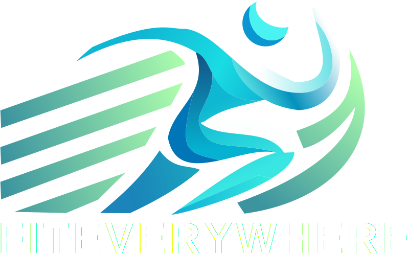

[](https://github.com/MESW-LES-2425/FitEverywhere-T2E/actions/workflows/cd.yml)
[](https://github.com/MESW-LES-2425/FitEverywhere-T2E/actions/workflows/cd.yml)
[](https://github.com/MESW-LES-2425/FitEverywhere-T2E/actions/workflows/ci.yml)

<p align="center"><a href="http://fiteverywhere.me" target="_blank"></a></p>

# Welcome to FitEverywhere!
**FitEverywhere** is a fitness management platform designed to connect customers, personal trainers, and gym managers through a seamless digital experience. This README provides an overview of the deployed environments, steps to start the application, and a summary of the tech stack used. All project documentation, planning, and progress are available on our [Wiki Page](https://github.com/MESW-LES-2425/FitEverywhere-T2E/wiki).


## Table of Contents
- [Deployed Servers](#deployed-servers)
- [Tech Stack](#tech-stack)
- [Getting Started](#getting-started)
  - [Prerequisites](#prerequisites)
  - [Project Setup](#local-development-setup)
- [Continuous Integration & Deployment](#continuous-integration--deployment)
- [Support and Feedback](#support-and-feedback)
- [License](#license)

---

## Overview

**FitEverywhere** aims to revolutionize the fitness industry by offering a digital platform that simplifies the interaction between key stakeholders: customers, trainers, and gym managers. The platform includes features such as user authentication, gym management, trainer scheduling, and customer engagement tools, all within a user-friendly interface.

The project leverages modern web development practices, advanced DevOps methodologies, and a scalable architecture to ensure both performance and maintainability. For detailed project planning, architectural diagrams, and progress tracking, please refer to the [Wiki Page](https://github.com/MESW-LES-2425/FitEverywhere-T2E/wiki).

## Deployed Servers

**FitEverywhere** has two fully dockerized environments:

1. **Production Environment**
    - **URL**: [http://fiteverywhere.me](http://fiteverywhere.me)
    - **Port**: 80 (reverse-proxied via Nginx)
    - **Description**: The main production environment where stable and thoroughly tested features are available for end-users.

2. **Development Environment**
    - **URL**: [http://dev.fiteverywhere.me](http://dev.fiteverywhere.me)
    - **Port**: 80 (reverse-proxied via Nginx)
    - **Description**: A development environment for testing new features and ongoing development updates before they are released to production.

## Tech Stack

FitEverywhere uses a modern, robust stack designed to deliver efficient and scalable applications:

- **Frontend**:
    - **React** (TypeScript) - A fast and interactive UI framework.
    - **Vite** - Development server and build tool for optimized front-end performance.
    - **Google OAuth2** - Authentication for secure login and user management.
    - **Docker** - Containerization to ensure consistent environments across development, testing, and production.

- **Backend**:
    - **Spring Boot** (Java) - Backend framework for scalable and RESTful API development.
    - **MySQL** - Database for handling structured application data.
    - **Docker** - Containerization to ensure consistent environments across development, testing, and production.

- **DevOps**:
    - **Docker Compose** - Manages multi-container applications for isolated services.
    - **Nginx** - Reverse proxy for load balancing and serving the app.
    - **CI/CD** - GitHub Actions for continuous integration and delivery, ensuring code quality and automated deployments.
    - **Azure** - Cloud platform for hosting both the application and database.

## Getting Started

### Prerequisites

- **Docker** and **Docker Compose** installed on your local machine.

### Local Development Setup

To start the app in a development environment, follow these steps:

1. **Clone the Repository**:
   ```bash
   git clone https://github.com/MESW-LES-2425/FitEverywhere-T2E.git
   cd FitEverywhere-T2E
   ```
2. **Start the Application**:
   ```bash
   docker compose up --build
   ```

## Continuous Integration & Deployment

FitEverywhere utilizes a CI/CD pipeline to ensure high code quality and smooth deployments. Key features include:
- **Automated Testing**: Unit tests, integration tests, and end-to-end tests are run on every pull request.
- **Static Analysis**: Linting and code formatting checks are enforced to maintain a consistent code style.
- **Automated Deployments**: Merged changes trigger automated builds and deployments to both the development and production environments.

## Support and Feedback

Thank you for using FitEverywhere! We value feedback and encourage you to report any issues or request new features through our GitHub Issues page. For any inquiries, feel free to reach out to the project maintainers.

---
## License

This project is licensed under the MIT License, ensuring it remains open-source and accessible for modification and distribution.
